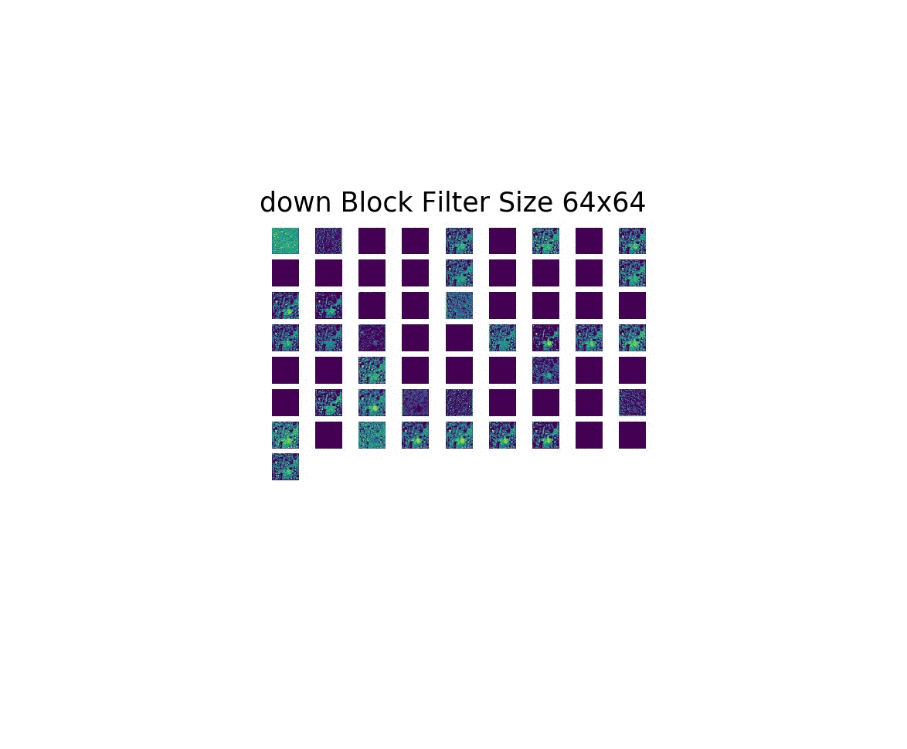

<p align="center"></p>

--------------------------------------------------------------------------------
# U-Net
Pytorch implementation of U-Net

[](https://opensource.org/licenses/MIT)
[](https://www.python.org/downloads/release/python-360/)
[](https://travis-ci.com/mukeshmithrakumar/U-Net)
[](https://github.com/ellerbrock/open-source-badges/)
[](http://hits.dwyl.io/mukeshmithrakumar/U-Net)
[]()


### If this repository helps you in anyway, show your love :heart: by putting a :star: on this project :v: 
<!-- Place this tag where you want the button to render. -->
<a class="github-button" href="https://github.com/mukeshmithrakumar/U-Net" data-icon="octicon-star" aria-label="Star mukeshmithrakumar/U-Net on GitHub">Star</a>

### For any questionsn and collaborations you can reach me via: 
[](https://www.linkedin.com/in/mukesh-mithrakumar/)

## (Work in Progress)

The __Goal__ of the project is to develop a generalizable model to assist in the evaluation of lesions 
(e.g. benign and malignant tumors, multiple sclerosis and cysts) in CT and MRI scans for multiple organs.

Currently the code works for the ISBI Neuronal Stack Segmentation dataset. 
See Future Works for upcoming updates

### Folder Structure

```
root_dir
    - data (The folder containing data files for training and testing)
    - model (PyTorch u-net model)
        - u_net.py
    - optimize
        - config.py
        - hyperparameter.py
    - processing
        - augments.py
        - load.py
    - trainer
        - train_logs (will be created)
        - weights (will be created)
        - evaluate.py
        - task.py
        - train.py
    - utils
        - helpers.py
        - metrics.py
        - proto.py
        - unit_test.py
    - visualize
        - interpret.py
        - logger.py
        - plot.py
```

## Usage

### Train Mode
To train the model run:
```
task.py root_dir(path/to/root directory)
```

#### Logging 
To activate logging of the errors (:default is set as no)
```
task.py root_dir(path/to/root directory) --log yes
```

To see the log in tensorboard follow the log statement after training:


#### Network Graph
Since Pytorch graphs are dynamic I couldn't yet integrate it with thensorflow but as a quick hack run the following
to build a png version of the model architecture (:default is set as no)
```
task.py root_dir(path/to/root directory) --build_graph yes
```


### Test Mode
To evaluate the model on the test data run:
```
task.py root_dir(path/to/root directory) --mode evaluate
```

### Interpret Mode
To visualize the intermediate layers:
```
task.py root_dir(path/to/root directory) --mode interpret
```

#### Sensitivity Analysis
Is the default option if you activate interpret mode


#### Block Analysis
To visualize the weight output of each downsampling block run:
```
task.py root_dir(path/to/root directory) --mode interpret --plot_interpret block_filters
```



### Keep an eye out :eyes: for upcoming updates via clicking:


## Upcoming Updates
- finish visualize.py with individual layer visualization and upsampling blocks
- write keys for arguments
- work on the hyperparamters.py and config.py to write a script to tune hyperparameters
- finish unit_test.py
- modify the unet to work on MRI data
- test on the CHAOS Segmentation challenge
- modify the unet to work on CT scan
- test on the PAVES Segmentation challenge
- write a neural architecture search script
- explore possibilities of converting the tensorflow capsnet to pytorch capsnet
- run the capsnet on the above challenges
- write a visualization for capsnet
- compare unet and capsnet
- write the paper on visualizing models for biomedical image segmentation
- One U-Net to segment different organs and a classifier to identify between the organs and another seperate classifier to detect cancer cells