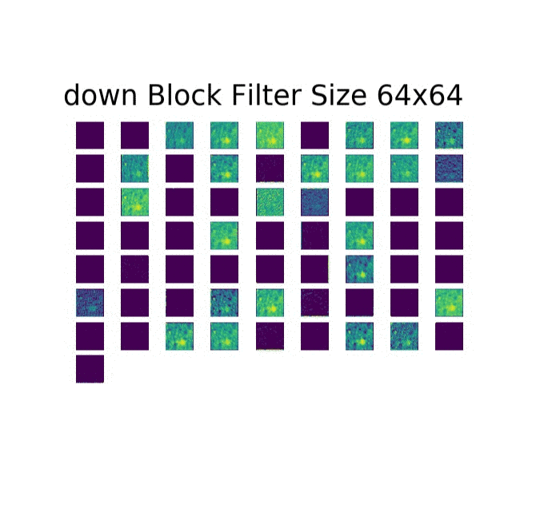

<p align="center"></p>

# U-Net
Pytorch implementation of U-Net

[](https://github.com/ellerbrock/open-source-badges/)
[](https://opensource.org/licenses/MIT)
[](https://www.python.org/downloads/release/python-360/)
[](https://travis-ci.com/mukeshmithrakumar/U-Net)
[](https://coveralls.io/github/mukeshmithrakumar/UNet?branch=master)

### If this repository helps you in anyway, show your love :heart: by putting a :star: on this project :v: 
[](https://github.com/mukeshmithrakumar/U-Net/stargazers)
[](http://hits.dwyl.io/mukeshmithrakumar/U-Net)

### For any questions and collaborations you can reach me via: [](https://www.linkedin.com/in/mukesh-mithrakumar/)

## (Work in Progress)
The __Goal__ of the project is to develop an open source software package to assist radiologists in the evaluation of 
lesions in CT and MRI scans for multiple organs.

Currently the code works for the ISBI Neuronal Stack Segmentation dataset. 
See upcoming updates for more info

### Folder Structure

```
main_dir
    - data (The folder containing data files for training and testing)
    - pytorch_unet (Package directory)
        - model (PyTorch u-net model)
            - u_net.py
        - optimize
            - config.py
            - hyperparameter.py
        - processing
            - augments.py
            - load.py
        - trainer
            - train_logs (will be created)
            - visualize (will be created)
            - weights (will be created)
            - evaluate.py
            - interpret.py
            - train.py
        - utils
            - helpers.py
            - metrics.py
            - proto.py
            - unit_test.py
        - visualize
            - logger.py
            - plot.py
```

## Usage

### 1. Train Mode
To train the model run:
```
task.py root_dir(path/to/root directory)
```

#### Logging 
To activate logging of the errors (:default is set as no)
```
task.py root_dir(path/to/root directory) --log yes
```

To see the log in tensorboard follow the log statement after training:


#### Network Graph
Since Pytorch graphs are dynamic I couldn't yet integrate it with thensorflow but as a quick hack run the following
to build a png version of the model architecture (:default is set as no)
```
task.py root_dir(path/to/root directory) --build_graph yes
```


### 2. Test Mode
To evaluate the model on the test data run:
```
task.py root_dir(path/to/root directory) --mode evaluate
```

### 3. Interpret Mode
To visualize the intermediate layers:
```
task.py root_dir(path/to/root directory) --mode interpret
```

#### Sensitivity Analysis
Is the default option when you run interpret mode


#### Block Analysis
To visualize the weight output of each downsampling block run:
```
task.py root_dir(path/to/root directory) --mode interpret --plot_interpret block_filters
```
<p align="center"></p>


## Keep an eye out :eyes: for Upcoming Updates [](https://github.com/mukeshmithrakumar/U-Net/watchers)
- work on the hyperparamters.py and config.py to write a script to tune hyper parameters
- add multi gpu capabilities
- work on a biomedical image pre-processing script
- write unit_test.py for the above
- add code coverage to check tests and iterate
- modify the unet to work on MRI data
- test on the CHAOS Segmentation challenge
- modify the unet to work on CT scan
- test on the PAVES Segmentation challenge
- write a neural architecture search script
- Build a classifier to identify between the organs (One U-Net to segment different organs) 
- Build another separate classifier to identify different cells
- Build the PyPI package
- Write a demo in colab
- Build a graphical user interface that for u-net
- Abstract away the deep learning stuff so its not python/deep learning friendly but more like doctor friendly
- Build into a software package