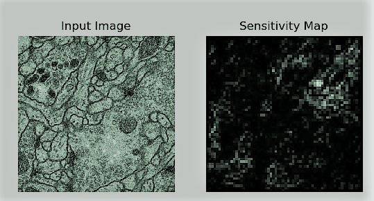

<p align="center"></p>

<h1 align="center">RadNet</h1>

<p align="center">Package for bio-medical image segmentation.</p>

<p align="center">
    <a href="https://github.com/ellerbrock/open-source-badges/">
        
    </a>
    <a href="https://opensource.org/licenses/MIT">
        
    </a>
    <a href="https://www.python.org/downloads/release/python-360/">
        
    </a>
    <a href="https://travis-ci.com/adhiraiyan/radnet">
        
    </a>
    <a class="badge-align" href="https://www.codacy.com/app/mukesh_4/radnet?utm_source=github.com&amp;utm_medium=referral&amp;utm_content=adhiraiyan/radnet&amp;utm_campaign=Badge_Grade">
    </a>
    <a href="https://coveralls.io/github/adhiraiyan/radnet?branch=master">
        
    </a>
    <a href="https://github.com/adhiraiyan/radnet/releases">
        
    </a>
    <a href="https://github.com/adhiraiyan/radnet/stargazers">
        
    </a>
    <a href="https://www.linkedin.com/in/mukesh-mithrakumar/">
        
    </a>
</p>

<p align="center">
    <a href="#clipboard-getting-started">Getting Started</a> •
    <a href="#hourglass-train">Train</a> •
    <a href="#watch-test">Test</a> •
    <a href="#chart_with_downwards_trend-interpret">Interpret</a> •
    <a href="#chart_with_upwards_trend-performance">Performance</a> •
    <a href="#octocat-release-notes">Release Notes</a> •
    <a href="#octocat-upcoming-releases">Upcoming Releases</a> •
    <a href="#copyright-citation">Citation</a> •
    <a href="#speech_balloon-faq">FAQ</a> •
    <a href="" target="_blank">Blog</a>
</p>

<h6 align="center">Made by Mukesh Mithrakumar • :milky_way: <a href="https://mukeshmithrakumar.com">https://mukeshmithrakumar.com</a></h6>


<h2 align="center">What is it :question:</h2>
**RadNet** is an ensemble convolutional neural network package (using U-Net, VGG, and Resnet) for biomedical image
detection, segmentation and classification.

Currently the code works for the ISBI Neuronal Stack Segmentation dataset. See [Release Notes](#octocat-release-notes)
for the
current release features and see [Upcoming Releases](#octocat-upcoming-releases) for the next release enhancements.

If this repository helps you in anyway, show your love :heart: by putting a :star: on this project :v:

**Please Note** that since this is a developer release content is being constantly developed and till I test everything completely I won't be committing updates into the repo so if you run into any issues, please reach out. The best way to prevent this is to use the released source for developing.

<h2 align="center">:clipboard: Getting Started</h2>


### :dvd: Software Prerequisites:

<details>
    <summary> To see the software prerequisites (click to expand...)</summary>

    ```
    - pip install 'matplotlib'
    - pip install 'graphviz'
    - pip install 'tensorflow'
    - pip install 'scikit-learn'
    - pip install 'tifffile'
    - pip install 'Pillow'
    - pip install 'scipy'
    - pip install 'numpy'
    - pip install 'opencv-python>=3.3.0'
    - pip install 'torch'
    - pip install 'torchvision'
    - pip install 'pytest'
    - pip install 'flake8'
    - pip install 'cython'
    - pip install 'psutil'
    ```
    
</details>

### :computer: Hardware Prerequisites:

Runs on a NVIDIA GeForce GTX 1050 Ti with 4 GB GDDR5 Frame Buffer and 768 NVIDIA CUDA® Cores.

### :blue_book: Folder Structure

<details>
    <summary> To see the folder structure (click to expand...)</summary>

    ```
    main_dir
    - data (The folder containing data files for training and testing)
    - pytorch_unet (Package directory)
        - model (PyTorch u-net model)
            - u_net.py
        - optimize
            - c_extensions.pyx
            - config.py
            - hyperparameter.py
            - multi_process.py
            - performance.py
        - processing
            - augments.py
            - load.py
        - trainer
            - evaluate.py
            - interpret.py
            - train.py
        - utils
            - helpers.py
            - metrics.py
            - unit_test.py
        - visualize
            - logger.py
            - plot.py
    - train_logs (will be created)
    - visualize (will be created)
    - weights (will be created)
    ```
</details>

### :wrench: Install
Currently you can clone the repo and start building, mean while, am working on the PyPi release, so will be updated


<h2 align="center">:hourglass: Train</h2>
<p align="right"><a href="#radnet"><sup>▴ Back to top</sup></a></p>

Train the model by running:

```
train.py root_dir(path/to/root directory)
```

Arguments that can be specified in the training mode:
```
usage: train.py [-h] [--main_dir MAIN_DIR] [--resume] [-v]
                [--weights_dir WEIGHTS_DIR] [--log_dir LOG_DIR]
                [--image_size IMAGE_SIZE] [--batch_size BATCH_SIZE]
                [-e EPOCHS] [-d DEPTH] [--n_classes N_CLASSES]
                [--up_mode {upconv, upsample}] [--augment]
                [--augment_type {geometric, image, both}]
                [--transform_prob TRANSFORM_PROB] [--test_size TEST_SIZE]
                [--log] [-bg]

Script for training the model

optional arguments:
  -h, --help            show this help message and exit
  --main_dir MAIN_DIR   main directory
  --resume              Choose to start training from checkpoint
  -v, --verbose         Choose to set verbose to False
  --weights_dir WEIGHTS_DIR
                        Choose directory to save weights model
  --log_dir LOG_DIR     Choose directory to save the logs
  --image_size IMAGE_SIZE
                        resize image size
  --batch_size BATCH_SIZE
                        batch size
  -e EPOCHS, --epochs EPOCHS
                        Number of training epochs
  -d DEPTH, --depth DEPTH
                        Number of downsampling/upsampling blocks
  --n_classes N_CLASSES
                        Number of classes in the dataset
  --up_mode {upconv, upsample}
                        Type of upsampling
  --augment             Whether to augment the train images or not
  --augment_type {geometric, image, both}
                        Which type of augmentation to choose from: geometric,
                        brightness or both
  --transform_prob TRANSFORM_PROB
                        Probability of images to augment when calling
                        augmentations
  --test_size TEST_SIZE
                        Validation size to split the data, should be in
                        between 0.0 to 1.0
  --log                 Log the Values
  -bg, --build_graph    Build the model graph
```

#### :clipboard: Logging
To activate logging of the errors (:default is set as no)

```
train.py root_dir(path/to/root directory) --log
```

To see the log in tensorboard follow the log statement after training:

<p align="center"></p>


#### :bar_chart: Network Graph
Since Pytorch graphs are dynamic I couldn't yet integrate it with tensorflow but as a quick hack run the following
to build a png version of the model architecture (:default is set as no)

```
train.py root_dir(path/to/root directory) -bg
```

<details>
    <summary> To see the output of the graph (click to expand...)</summary>
    <p align="center"></p>
</details>


<h2 align="center">:watch: Test</h2>
<p align="right"><a href="#radnet"><sup>▴ Back to top</sup></a></p>

Evaluate the model on the test data by running:

```
evaluate.py root_dir(path/to/root directory)
```

Arguments that can be specified in the evaluation mode:

```
usage: evaluate.py [-h] [--main_dir MAIN_DIR] [--image_size IMAGE_SIZE]
                   [--weights_dir WEIGHTS_DIR]

Script for evaluating the trained model

optional arguments:
  -h, --help            show this help message and exit
  --main_dir MAIN_DIR   main directory
  --image_size IMAGE_SIZE
                        resize image size to match train image size
  --weights_dir WEIGHTS_DIR
                        Choose directory to save weights model
```


<h2 align="center">:chart_with_downwards_trend: Interpret</h2>
<p align="right"><a href="#radnet"><sup>▴ Back to top</sup></a></p>

Visualize the intermediate layers by running:

```
interpret.py root_dir(path/to/root directory) 
```

Arguments that can be specified in the interpret mode:

```
usage: interpret.py [-h] [--main_dir MAIN_DIR]
                    [--interpret_path INTERPRET_PATH]
                    [--weights_dir WEIGHTS_DIR] [--image_size IMAGE_SIZE]
                    [--depth DEPTH]
                    [--plot_interpret {sensitivity,block_filters}]
                    [--plot_size PLOT_SIZE]

Script for interpreting the trained model results

optional arguments:
  -h, --help            show this help message and exit
  --main_dir MAIN_DIR   main directory
  --interpret_path INTERPRET_PATH
                        Choose directory to save layer visualizations
  --weights_dir WEIGHTS_DIR
                        Choose directory to load weights from
  --image_size IMAGE_SIZE
                        resize image size
  --depth DEPTH         Number of downsampling/upsampling blocks
  --plot_interpret {sensitivity,block_filters}
                        Type of interpret to plot
  --plot_size PLOT_SIZE
                        Image size of sensitivity analysis
```

#### :nut_and_bolt: Sensitivity Analysis
To do sensitivity analysis run:

```
interpret.py root_dir(path/to/root directory) --plot_interpret sensitivity
```

<p align="center"></p>

#### :nut_and_bolt: Block Analysis
To visualize the weight output of each up/down sampling block run:

```
interpret.py root_dir(path/to/root directory) --plot_interpret block_filters
```

<p align="center"></p>


<h2 align="center">:chart_with_upwards_trend: Performance</h2>
<p align="right"><a href="#radnet"><sup>▴ Back to top</sup></a></p>
(Work in Progress)


<h2 align="center">:octocat: Release Notes</h2>
<p align="right"><a href="#radnet"><sup>▴ Back to top</sup></a></p>

:gem: 0.1.0 Developer Pre-Release (Jan 01 2019)
- Works for the ISBI Neuronal Stack Segmentation dataset
- [Tensorboard logging](https://github.com/adhiraiyan/radnet/blob/master/pytorch_unet/visualize/logger.py) to visualize
training/validations/dice scores
- Build for PyTorch [static graph](https://github.com/adhiraiyan/radnet/blob/master/pytorch_unet/visualize/plot.py)
- Intermediate [filter layer
visualizations](https://github.com/adhiraiyan/radnet/blob/master/pytorch_unet/trainer/interpret.py)


<h2 align="center">:octocat: Upcoming Releases</h2>
<p align="right"><a href="#radnet"><sup>▴ Back to top</sup></a></p>

Keep an eye out :eyes: for Upcoming Releases:
<a href="https://github.com/adhiraiyan/radnet/watchers">
    
</a>

:fire: 0.2.0 Developer Pre-Alpha
- [performance.py](https://github.com/adhiraiyan/radnet/blob/master/pytorch_unet/optimize/performance.py) to measure
code performance and optimize code
- [hyperparameters.py](https://github.com/adhiraiyan/radnet/blob/master/pytorch_unet/optimize/hyperparameter.py) to
tune hyper parameters
- [config.py](https://github.com/adhiraiyan/radnet/blob/master/pytorch_unet/optimize/config.py) with configs for the
hyper parameters
- [multi gpu/multi processing](https://github.com/adhiraiyan/radnet/blob/master/pytorch_unet/optimize/multi_process.py)
data training.
- [c extensions](https://github.com/adhiraiyan/radnet/blob/master/pytorch_unet/optimize/c_extensions.pyx) for certain
functions
- complete [unit_test.py](https://github.com/adhiraiyan/radnet/blob/master/pytorch_unet/utils/unit_test.py) for the
above
- code coverage to check tests and iterate
- Pre alpha [PyPI package]()

:fire: 0.3.0 Developer Alpha
- Biomedical image pre-processing script
- modifications for the unet to work on MRI data
- test on the CHAOS Segmentation challenge
- modifications for the unet to work on CT scan
- test on the PAVES Segmentation challenge
- complete [unit_test.py](https://github.com/adhiraiyan/radnet/blob/master/pytorch_unet/utils/unit_test.py) for the
above
- Deploy alpha [PyPI package]()

:fire: 0.4.0 Developer Alpha
- Neural architecture search script
- Classifier to identify between the organs (One U-Net to segment different organs)
- Separate classifier to identify different cells
- Deploy alpha [PyPI package]()

:fire: 0.5.0 Science/Research Beta
- Graphical user interface for RadNet
- Developer and researcher mode for the GUI
- Abstracted away the deep learning stuff so its not python/deep learning friendly but more like doctor friendly
- Build into a software package
- Deploy beta [PyPI package]()


<h2 align="center">:copyright: Citation</h2>
<p align="right"><a href="#radnet"><sup>▴ Back to top</sup></a></p>


<h2 align="center">:speech_balloon: FAQ</h2>
<p align="right"><a href="#radnet"><sup>▴ Back to top</sup></a></p>

- For any questions and collaborations you can reach me via [LinkedIn](https://www.linkedin.com/in/mukesh-mithrakumar/)
